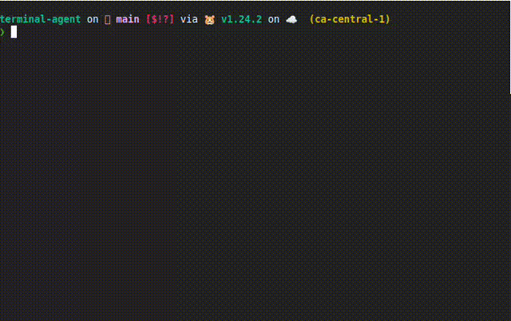

# Terminal Agent Documentation

Welcome to Terminal Agent - an LLM-powered assistant for your terminal needs.

## Contents

- [Getting Started]({{ site.baseurl }}/getting-started) - Installation and basic setup
- [Commands]({{ site.baseurl }}/commands) - Detailed usage of all commands
  - [Ask Command]({{ site.baseurl }}/commands/ask) - Ask questions directly from terminal
  - [Task Command]({{ site.baseurl }}/commands/task) - Execute tasks with AI assistance
  - [Tool Command]({{ site.baseurl }}/commands/tool) - Use and manage tools
  - [Config Command]({{ site.baseurl }}/commands/config) - Configure agent settings
  - [History Command]({{ site.baseurl }}/commands/history) - Query interaction history
- [Providers]({{ site.baseurl }}/providers) - Supported LLM providers
- [Configuration]({{ site.baseurl }}/configuration) - Advanced configuration options
- [Tools]({{ site.baseurl }}/tools) - Available tools and extending functionality
- [Examples]({{ site.baseurl }}/examples) - Usage examples and patterns
- [Developers]({{ site.baseurl }}/developers) - Guide for contributors and developers

### Quick examples

