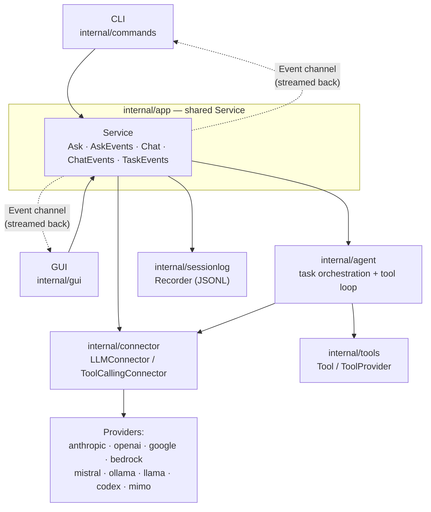
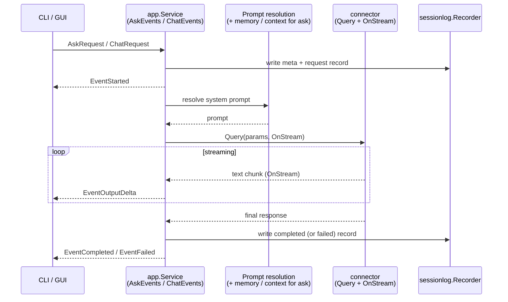
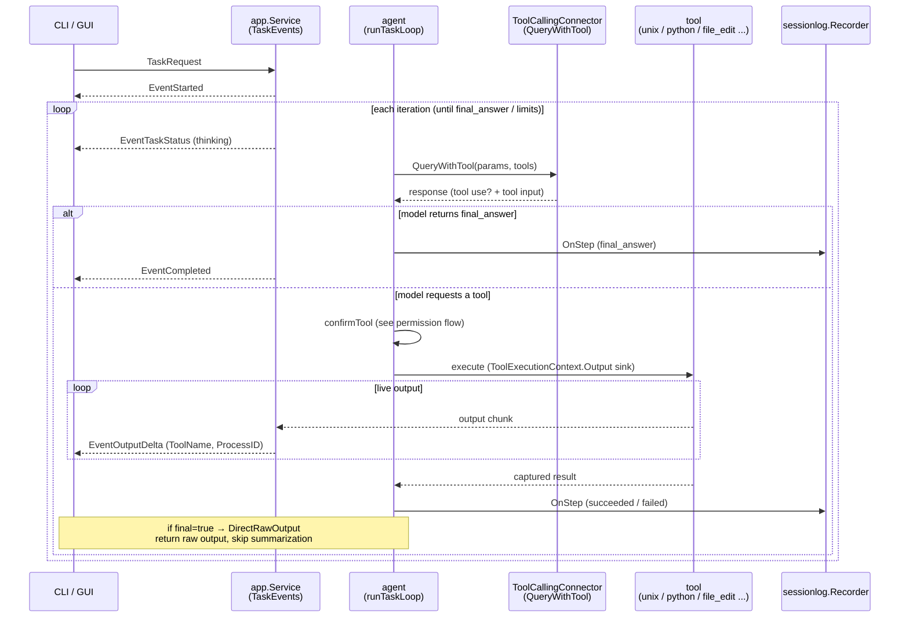
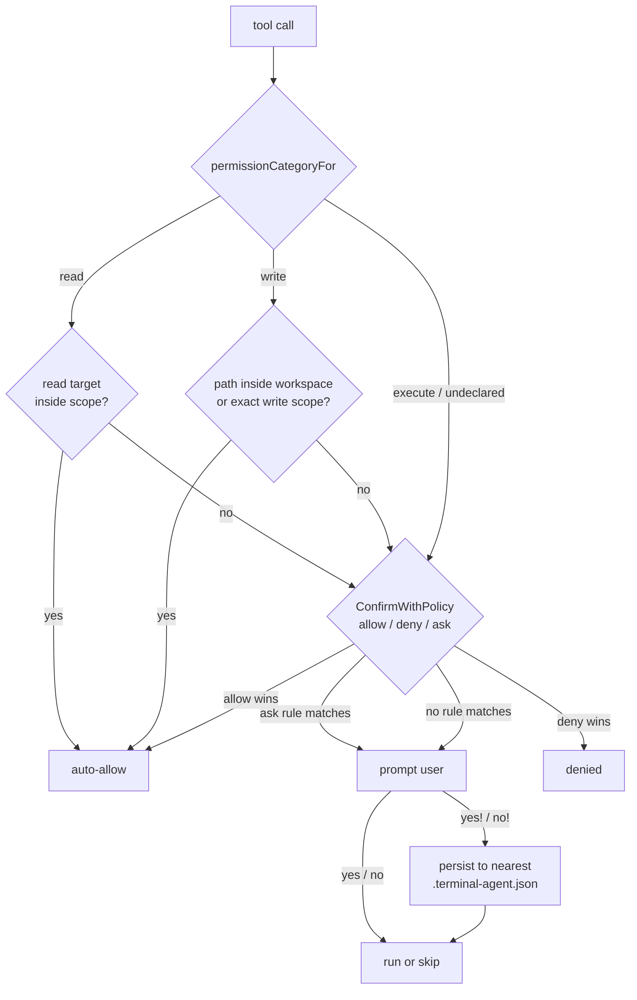

# Architecture

This page explains how Terminal Agent's components fit together and how its
event-driven workflows operate. The diagrams below reference real package,
type, and function names so you can jump straight from a diagram to the code.

The central idea: both entrypoints — the **CLI** (`internal/commands`) and the
**GUI** (`internal/gui`) — depend on a single shared application-service layer,
`internal/app.Service`. That service is the boundary where prompts are resolved,
runs are orchestrated, events are streamed, and session logs are written.
Because both surfaces share it, a change in `internal/app` is a cross-surface
change even when only one entrypoint appears affected.

## Component / layer map

The CLI and GUI talk only to `app.Service`. The service fans out to the agent
orchestrator, the LLM connectors, the tool implementations, and the session
logger.



**Key types / files:** `Service` interface and `Event` type in
`internal/app/service.go`; provider dispatch in
`internal/connector/main.go` (`NewConnector`); `Tool` / `ToolProvider` in
`internal/tools`.

## Ask / chat flow

`ask` and `chat` are streaming, non-agentic flows: resolve a prompt, call the
connector, stream text deltas back as events. Only `ask`/`chat` may layer in
memory and context files; `task` does not. Session-log records are written
inline at request, completion, and failure.



**Key types / files:** `internal/app/ask.go`, `internal/app/chat.go`;
`QueryParams.OnStream` in `internal/connector/types.go`. Recording is inlined at
each call site (request / completed / failed).

## Task event workflow

`task` is the agentic flow. The agent runs an iterative loop: ask the model,
and if it requests a tool, confirm and execute that tool, feeding results back
until the model returns a final answer. Every step is forwarded through the
`OnStep` callback into the session log, and live tool output is streamed as
`EventOutputDelta`. When a tool is invoked with `final=true`, its raw output is
returned directly without another summarization round (`DirectRawOutput`).



**Key types / files:** `runTaskLoop`, `handleTaskToolResponse`,
`executeTaskTool`, `TaskOptions.OnStep`, `taskStepToRecord` in
`internal/agent/task.go`; the `TaskEvents` wiring in `internal/app/task.go`;
the live `Output` sink in `tools.ToolExecutionContext`.

## Permission / confirmation flow

Whether a tool runs without prompting is decided in two stages. First, a
per-tool **permission category** sets the default: `read` generally does not
prompt, `file_search` prompts when the requested root is outside the current
read scope, `write` is allowed when the target resolves inside the workspace
root or an exact approved write path, `execute` always prompts, and any
undeclared tool is treated as `execute`. Second, the `allow` / `deny` / `ask`
rule engine overrides that default.



When a prompt is required, the agent core does not talk to the terminal or
window directly. It calls `Interaction.Confirm`, and the app layer turns that
into an event carrying a `Reply` callback, then **blocks until the consumer
replies** — the same channel-based transport works for both CLI and GUI.

```mermaid
sequenceDiagram
    participant A as agent core<br/>(ConfirmationManager)
    participant I as app.taskEventInteraction
    participant U as CLI / GUI consumer

    A->>I: Interaction.Confirm(req)
    I-->>U: EventConfirmationNeeded<br/>(Action + Reply callback)
    note over I: blocks on internal replies channel
    U->>U: render prompt, read user decision
    U->>I: Reply(response)
    I-->>A: TaskConfirmationDecision<br/>(Allowed, Remember, Patterns)
    note over A: decision cached for this run;<br/>Remember persists via rememberFunc
```

**Key types / files:** `permissionCategoryFor` and `confirmTool` in
`internal/agent/task.go`; `ConfirmWithDefault` / `ConfirmWithPolicy` and the
rule engine in `internal/agent/confirmation.go`; `Confirm` / `Clarify`
transport in `internal/app/task.go`; config discovery in
`LoadPermissionRuleSets` (`internal/config/permissions.go`), which walks from
the current directory up to the filesystem root.
