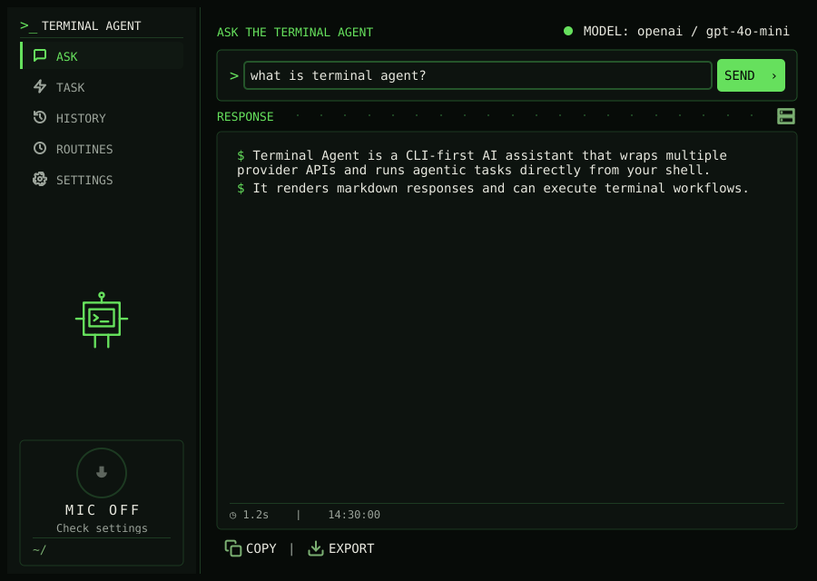
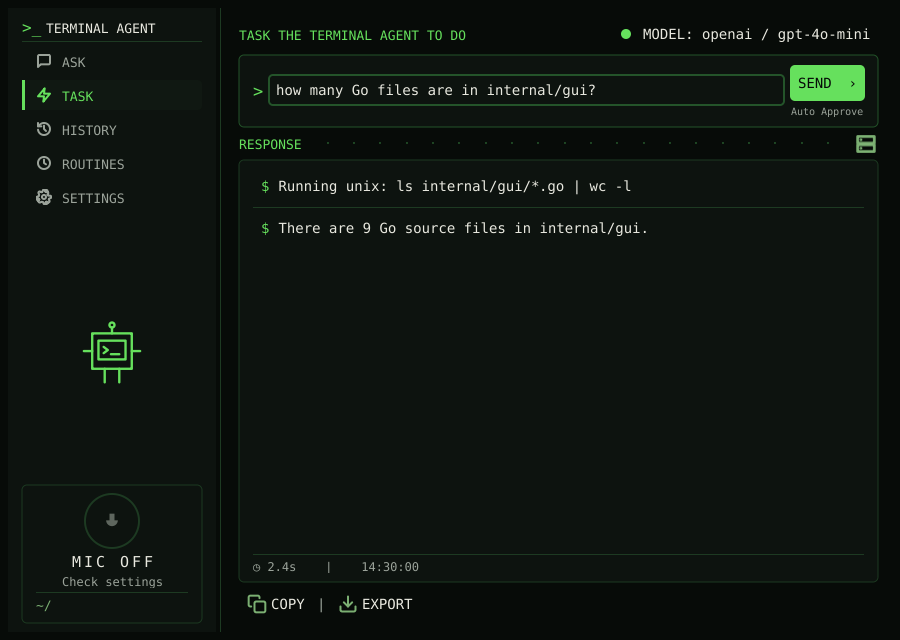
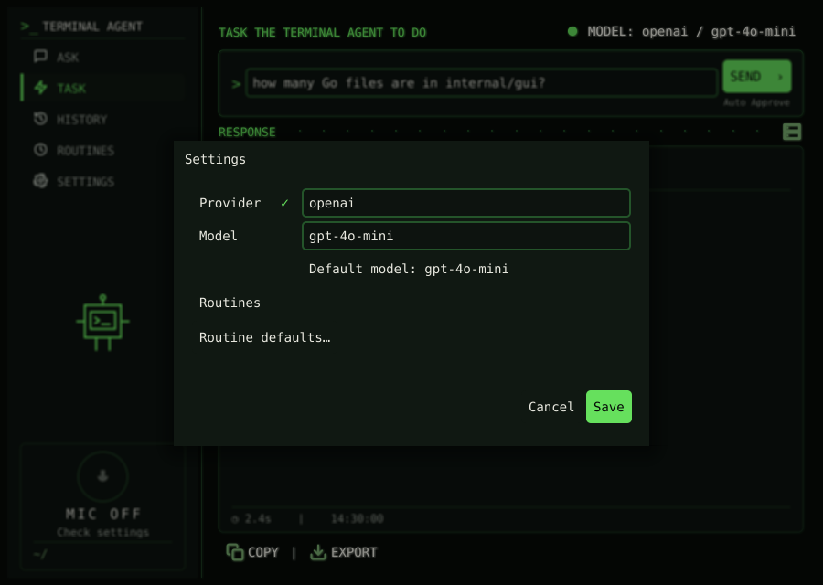
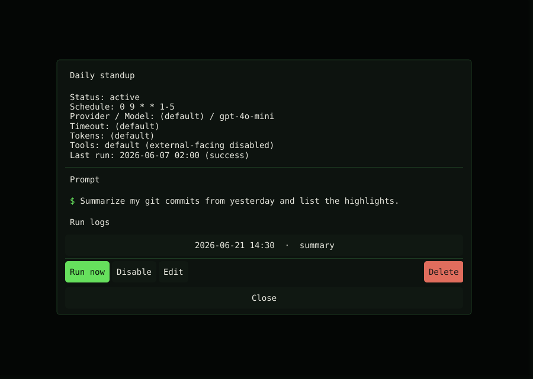
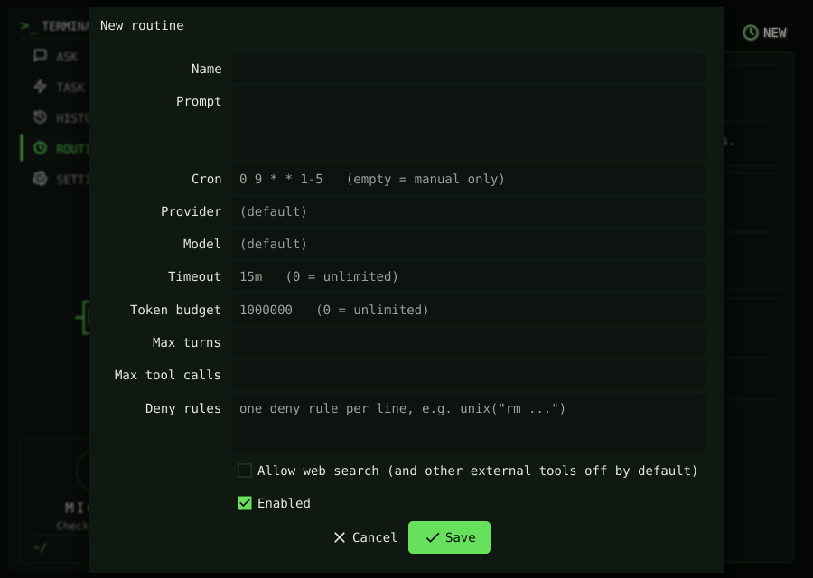

# Developer Guide

This guide provides information for developers who want to contribute to Terminal Agent.

## Development Environment Setup

### Prerequisites

Before you begin, ensure you have the following installed:

1. **Go** - Terminal Agent is written in Go (1.20+ recommended)
   * [Official Go Installation Guide](https://golang.org/doc/install)
   * Verify installation with: `go version`

2. **Taskfile** - Used instead of Makefile for running tasks
   * [Taskfile Installation Guide](https://taskfile.dev/installation/)
   * Verify installation with: `task --version`

3. **Docker** - Required for running integration tests
   * [Docker Installation Guide](https://docs.docker.com/get-docker/)
   * Verify installation with: `docker --version`

### Setting Up the Repository

1. **Clone the repository**
   ```sh
   git clone https://github.com/laszukdawid/terminal-agent.git
   cd terminal-agent
   ```

2. **Install dependencies**
   ```sh
   task setup
   ```

3. **Build the project**
   ```sh
   task build
   ```

4. **Run tests**
   ```sh
   task test
   ```

## Development Workflow

### Common Tasks

Terminal Agent uses Taskfile for managing development tasks. Here are some common commands:

```sh
# Build the project
task build

# Install to your PATH
task install

# Install the Git pre-commit hook
task install:pre-commit
# or, on distros that package the binary under a different name
go-task install:pre-commit

# Run unit tests
task test

# Run integration tests
task test:integ

# Run the agent with a question
task run:ask -- "What is a file descriptor?"

# Run the agent with a task
task run:task -- "List files in current directory"

# Set environment for different providers
task run:set:openai
task run:set:anthropic
task run:set:bedrock
task run:set:google
```

To see all available tasks:

```sh
task --list
```

The pre-commit installer copies the repository-tracked hook from `.githooks/pre-commit` into Git's active hooks directory, so rerun `task install:pre-commit` or `go-task install:pre-commit` after pulling hook changes. The installed hook will use `task` or `go-task`, whichever is available.

### Project Structure

```
terminal-agent/
├── cmd/                      # Command-line applications
│   └── agent/                # Main agent application
├── internal/                 # Private application and library code
│   ├── agent/                # Agent implementation
│   ├── commands/             # CLI command implementations
│   ├── config/               # Configuration handling
│   ├── connector/            # LLM provider connectors
│   ├── history/              # History logging and retrieval
│   ├── tools/                # Tool implementations
│   └── utils/                # Utility functions
├── docs/                     # Documentation
├── tests/                    # Test files
└── Taskfile.dist.yaml        # Development tasks
```

For diagrams of how these components connect and how the event-driven
ask/chat/task workflows operate, see the [Architecture](architecture.md) page.

### Docker Environment

For integration testing and consistent development environments, Terminal Agent uses Docker:

```sh
# Build the test environment
task env:build

# Setup the test environment
task env:setup

# Access the test environment
task env:access

# Run tests in the environment
task env:test
```

## Adding LLM Provider Support

To add support for a new LLM provider:

1. Create a new connector file in `internal/connector/`
2. Implement the `LLMConnector` interface
3. Update the `NewConnector` factory function to include your provider
4. Add appropriate configuration options

## Adding New Tools

To add a new tool:

1. Create a new tool implementation in `internal/tools/`
2. Implement the `Tool` interface
3. Update the `ToolProvider` to return your new tool
4. Add documentation for your tool

Tools that run long-lived processes or produce incremental output should also support `tools.ToolExecutionContext.Output` when they implement `ContextualTool` or `ContextAwareTool`. Write live user-facing chunks to `Output` as they become available, but still return the captured final result from `RunSchema*` so the task agent can reason over it. If the output sink implements `tools.ProcessesStartedWriter`, call `ProcessStarted(pid)` after the process starts so task events can include the process id in output and warning events.

## Documentation

Documentation is written in Markdown and stored in the `docs/` directory. To update the documentation:

1. Edit the relevant Markdown files
2. If adding new pages, update the navigation in `docs/Readme.md`

## GUI Architecture

The desktop popup (`cmd/agent-gui`) is a [Fyne](https://fyne.io/) application
under `internal/gui/`. End-user behavior is documented in the
[Popup GUI guide](gui.md); this section is for contributors working on the GUI
itself.

### Shared service layer

The GUI does **not** talk to connectors or prompt helpers directly. Like the CLI
commands, it depends on the shared `internal/app` service interface (`AskEvents`,
`TaskEvents`, etc.). Both surfaces consume the same event-driven API, so a change
in `internal/app` is a cross-surface change even when it looks CLI-only. See the
[Architecture](architecture.md) page for the event model.

### Layout and key files

| Concern | File(s) |
| --- | --- |
| Entry point, single-instance IPC, voice/version wiring | `cmd/agent-gui/main.go` |
| App lifecycle, show/hide, tray menu, indicator ticker | `internal/gui/app.go` |
| Window construction, layout, shortcuts | `internal/gui/main_window.go` |
| Submit / cancel / copy / export actions | `internal/gui/actions.go` |
| Ask/Task event consumption (presenter) | `internal/gui/presenter.go`, `internal/gui/task.go` |
| Per-mode view state and persistence | `internal/gui/state.go` |
| Live tool-output truncation | `internal/gui/livelimit.go` |
| Task transcript model and rendering | `internal/gui/transcript.go`, `internal/gui/transcript_view.go` |
| Clarification/confirmation dialogs | `internal/gui/interaction.go` |
| Settings dialog, provider autocomplete, status icon | `internal/gui/settings_dialog.go`, `internal/gui/provider_entry.go`, `internal/gui/provider_status_icon.go` |
| Voice controller integration | `internal/gui/voice.go` |
| History tab and detail modal | `internal/gui/history.go` |
| Brand theme and icons | `internal/gui/theme.go`, `internal/gui/icons.go` |

Notes for contributors:

- Service events are drained on the Fyne UI thread via `fyne.Do`. Ask mode
  re-renders on each delta; Task mode sets a dirty flag that a ~140ms ticker in
  `app.go` flushes, so streamed tool output is coalesced rather than rendered per
  chunk.
- `state.go` snapshots each mode's view on switch, so moving between Ask, Task,
  and History does not discard the previous run.
- GUI Task runs with `AutoApprove` today; `taskAutoApprove()` in `app.go` is the
  single switch, and `EventConfirmationNeeded` is handled only as a deadlock
  backstop until interactive approval lands. `EventClarificationNeeded` already
  drives a real modal through `interaction.go`.
- Closing the window calls `Hide()` (close intercept), not quit.

### Building and running

```sh
# Build just the GUI binary
task build:gui

# Run the popup from source
task run:gui

# Install desktop-build dependencies for your platform
task deps:gui:macos    # or deps:gui:ubuntu / deps:gui:fedora
```

Fyne requires platform C toolchains/headers: Xcode Command Line Tools on macOS,
and X11/OpenGL dev packages on Linux (installed by the `deps:gui:*` tasks). The
`integration:*` tasks additionally install `agent-gui`, register a desktop entry,
and wire the `Ctrl+Shift+Space` shortcut; see the
[Integration guides](integration/fedora.md).

## GUI Screenshots

The popup GUI is rendered to PNG files without a display server or a live LLM
provider, so the images below can be regenerated deterministically to reflect
the current look. They double as documentation, PR illustrations, and quick
visual checks of GUI changes.

### Current look

**Ask mode** — a question and its rendered markdown answer:



**Task mode** — an agentic run, showing the tool-call transcript and final answer:



**Settings** — the provider/model dialog:



**Routine** — the list of scheduled routines with their status, schedule, and next run:


**Routine detail** — a routine's prompt, settings, run logs, and actions:



**Routine form** — creating or editing a routine:



### Regenerating the screenshots

```sh
# Re-renders the images into docs/assets/screenshots/ (committed doc assets)
task screenshots:gui

# Or choose a different output directory (must be an ABSOLUTE path)
task screenshots:gui OUT=/tmp/ta-shots
```

The committed files are:

| File (`docs/assets/screenshots/`) | State |
|------|-------|
| `gui-ask.png` | Ask mode with a rendered markdown response |
| `gui-task.png` | Task mode transcript (tool-call line + final answer) |
| `gui-settings.png` | Settings dialog (provider/model) |
| `gui-routine.png` | Routine list (status, schedule, model, last/next run) |
| `gui-routine-detail.png` | Routine detail (prompt, settings, run logs, actions) |
| `gui-routine-form.png` | Routine create/edit form |

### How it works

The task runs a single env-gated test, `TestCaptureScreenshots` in
`internal/gui/screenshot_test.go`. The test:

1. Builds the real `gui.App` with a Fyne test app (`test.NewApp()`), so the
   actual widgets, layout, and brand theme are exercised.
2. Drives `App`/`state` into each scenario (mode, input text, output, the Settings
   dialog, or the Routine list/detail/form) and calls `render()`. For the Routine
   views it redirects the routine stores to a temp dir and seeds representative
   routines so the captures are deterministic and never touch real user data.
3. Captures the window with `win.Canvas().Capture()` (Fyne's software renderer)
   and writes the image with `png.Encode`.

The test is skipped during normal runs (`task test`) and only executes when the
`GUI_SCREENSHOTS` environment variable points at an output directory. The
Taskfile sets that variable to `docs/assets/screenshots` for you.

> **Important:** `GUI_SCREENSHOTS` must be an absolute path. `go test` runs in
> the package directory, so a relative path would write into `internal/gui/`
> instead of the repo root. The `task screenshots:gui` wrapper always passes an
> absolute path.

### Adding or changing a captured state

Edit `TestCaptureScreenshots`: set the desired `App`/`state` fields (or show a
dialog), call `g.render()`, then call the local `capture("gui-name.png")`
helper. Use stable, descriptive `gui-*` names since the files are referenced by
name from the docs above.

### Known limitation: fenced code blocks

The pinned Fyne fork's **software** rasterizer crashes when drawing the brand
theme's fenced code blocks (a zero-stroke rounded-rectangle underflow), so the
captured states deliberately avoid ` ``` ` code fences. At runtime the Task
transcript wraps live tool stdout/stderr in a fenced block; that styling renders
correctly under the real **GL** renderer but cannot be captured headlessly.
`gui-task.png` therefore shows the transcript without the fenced live-output
box.

To capture the true fenced rendering, run the real binary and screenshot the
window with your OS tools:

```sh
task run:gui      # then capture the window with the OS screenshot tool
```

## Building for Release

To build for release:

```sh
task build:release
```

This creates optimized binaries for multiple platforms in the `release/` directory.

## Code Style and Conventions

* Follow standard Go code style and conventions
* Use `go fmt` to format code
* Use `golint` and `golangci-lint` for linting
* Write tests for new functionality
* Document public functions and types

## Pull Request Process

1. Fork the repository
2. Create a feature branch
3. Make your changes
4. Add/update tests as necessary
5. Ensure all tests pass
6. Update documentation if needed
7. Submit a pull request

## Debugging

For debugging, use the `--loglevel debug` flag:

```sh
go run cmd/agent/main.go --loglevel debug ask "What is a file descriptor?"
```

## Continuous Integration

The project uses GitHub Actions for continuous integration. When you submit a pull request, the CI system will automatically:

1. Build the project
2. Run unit tests
3. Run integration tests
4. Check code formatting

Ensure that all CI checks pass before your pull request can be merged.
