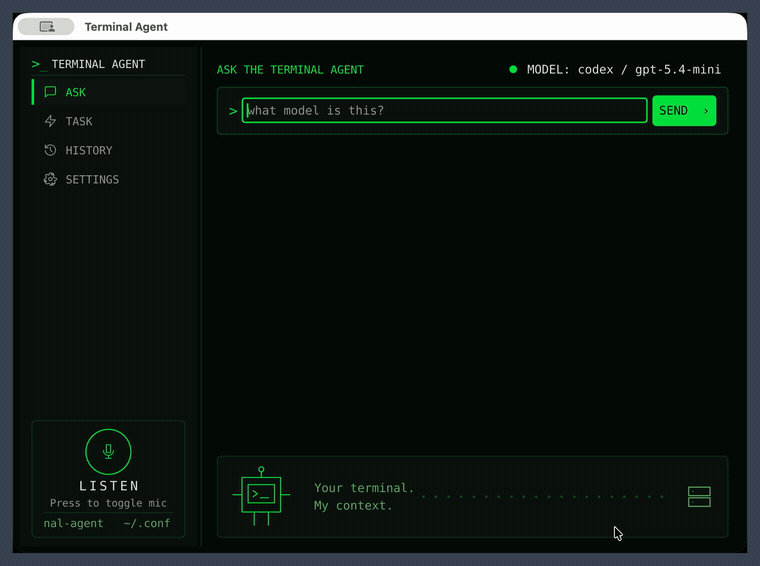
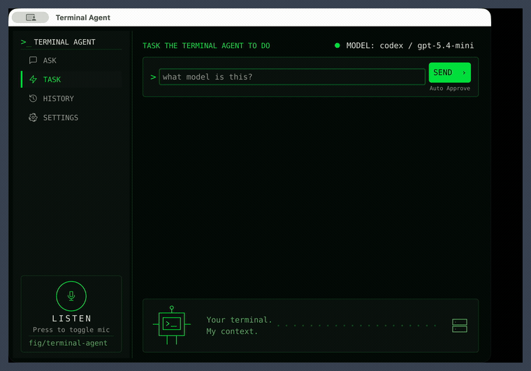
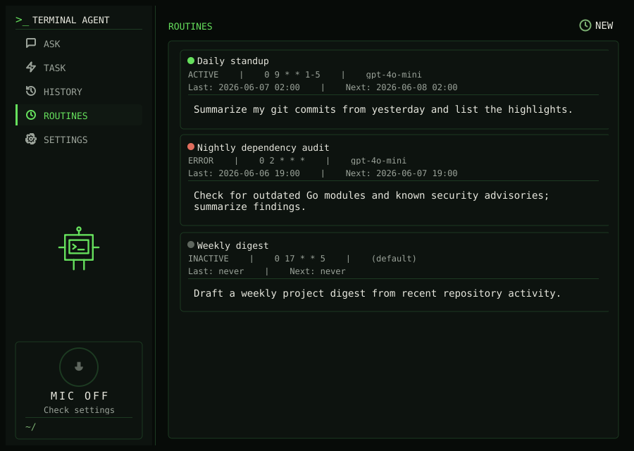
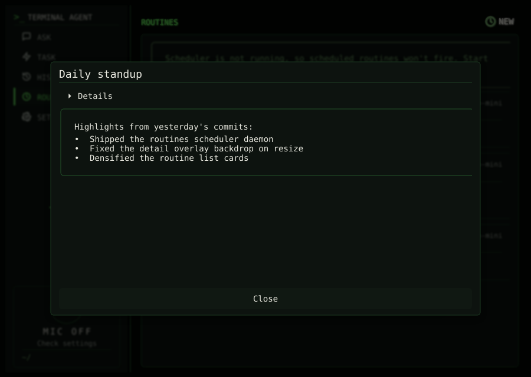

# Popup GUI

Terminal Agent ships with a desktop **popup GUI** (`agent-gui`) in addition to the
`agent` CLI. It is a single, always-ready window that you summon with a global
shortcut, type a prompt into, and dismiss again, without leaving whatever you
were doing. It talks to the exact same providers, models, tools, and session
logs as the CLI, so anything you configure for `agent` also applies here.

The popup has two working modes that mirror the CLI commands: **Ask** for quick
answers and **Task** for supervised, tool-using workflows.

## Ask mode

Ask mode is for quick questions. You type a prompt, press <kbd>Enter</kbd>, and
the answer streams back into the response panel as rendered markdown. Use the
**Copy** and **Export** buttons under the answer to put the response on your
clipboard or save it as a markdown file. The line beneath the answer shows how
long the run took and when it finished.

## Task mode

Task mode runs the agentic workflow: the model plans steps, calls tools (such as
`unix`, `python`, `file_search`, web search, and any configured MCP tools), and
returns a final answer. The transcript shows each tool call, streams live tool
output as it is produced, and finishes with the rendered answer.

!!! note "Approvals in the GUI"
    Task runs in the popup currently execute with **Auto Approve** on, indicated
    by the label next to the Send button. Actions run without a per-action
    confirmation prompt, so point it at work you are comfortable letting it
    perform. Interactive per-action approval in the GUI is planned for a future
    release; the CLI's [approval logic](approval-logic.md) already supports it
    today. When the agent needs to ask you a clarifying question it pauses and
    shows a small dialog, and the run continues once you answer.

    Live tool output shown in the transcript is capped per tool (see
    `task_live_output_limit` in [Configuration](configuration.md)); when output
    is truncated the transcript marks it and the full captured result is appended
    when the tool finishes.

## Launching the popup

The popup is designed to live in the background and appear on a keystroke. The
desktop integration tasks bind **<kbd>Ctrl</kbd>+<kbd>Shift</kbd>+<kbd>Space</kbd>**
to show or hide it:

- Ubuntu: `task integration:ubuntu`
- Fedora: `task integration:fedora`
- macOS: `task integration:macos`

On Linux these install `agent-gui` into `~/.local/bin/agent-gui`, add a desktop
entry, and (on GNOME) bind the shortcut for you; on KDE Plasma you bind
`Terminal Agent Popup` to the shortcut yourself in System Settings. On macOS the
task builds a `Terminal Agent.app` bundle in `~/Applications/` and symlinks the
binary. See the [Integration guides](integration/macos.md) for the per-platform
details.

To run it directly during development, use `task run:gui`. The window opens at a
default size of 860×600 and is resizable. Closing the window hides it rather than
quitting, so the next shortcut press brings it straight back; where the desktop
supports it, a system tray menu offers **Show**, **Hide**, and **Quit**.

## Input and keyboard shortcuts

The input box is multi-line and word-wrapped. The sidebar on the left switches
between **Ask**, **Task**, **History**, and **Settings**; the model currently in
use is shown in the top-right (`MODEL: provider / model`) with a status dot. Each
mode keeps its own view, so switching tabs does not discard the last run.

| Shortcut | Action |
| --- | --- |
| <kbd>Enter</kbd> | Submit the prompt |
| <kbd>Shift</kbd>+<kbd>Enter</kbd> | Insert a newline |
| <kbd>Esc</kbd> | Hide the window (or close an open detail/dialog) |
| <kbd>Cmd/Ctrl</kbd>+<kbd>L</kbd> | Focus the input box |
| <kbd>Cmd/Ctrl</kbd>+<kbd>Q</kbd> | Quit the app |
| <kbd>Ctrl</kbd>+<kbd>Shift</kbd>+<kbd>Space</kbd> | Show/hide the popup (set by the integration tasks) |

## Voice input

The mic control in the lower-left lets you dictate a prompt instead of typing.
With the window focused, press the configured trigger key or click **Listen** to
start recording; press again (or click **Stop**) to finish. The control reflects
its state (LISTEN → LISTENING → WORKING), transcribes the audio, and drops the
text into the input box. By default voice is enabled, the trigger key is
<kbd>F1</kbd>, and the transcript is submitted automatically through the Ask
path. Recording is toggle-based (not push-to-talk) and requires window focus;
there is no global voice hotkey. Raw audio is kept in memory and never written to
disk.

Voice behavior is configured under the `gui.voice` section of the config (see
[Configuration](configuration.md)):

| Setting | Default | Meaning |
| --- | --- | --- |
| `gui.voice.enabled` | `true` | Master on/off for voice input |
| `gui.voice.trigger_key` | `F1` | Key that toggles recording |
| `gui.voice.auto_submit` | `true` | Submit the transcript automatically once ready |
| `gui.voice.max_recording_duration` | `60s` | Stop recording after this long |
| `gui.voice.stt.backend` / `gui.voice.stt.model` / `gui.voice.stt.language` | `openai` / `gpt-4o-mini-transcribe` / — | Speech-to-text backend, model, and language |

The default OpenAI backend sends recorded audio to OpenAI for transcription and
reuses your OpenAI auth. Voice is disabled while a response is in flight so it
cannot collide with a running prompt.

## Switching providers and models

Open **Settings** to change the provider and model without editing a config
file. The dialog offers a provider field with autocomplete and a model field
that hints the default model for the chosen provider. A status icon (✓ / ✕) next
to the provider shows whether the required credentials or environment are in
place, with a tooltip explaining any problem, and the environment section
surfaces warnings from loading your env file or shell environment. Saving writes
the new defaults to `~/.config/terminal-agent/config.json`, so the choice sticks
across runs and matches what the CLI uses. The dialog footer shows the build
version.

See [Providers](providers.md) for what each provider needs.

## History

The **History** tab lists your recent `ask`, `chat`, and `task` runs, read from
the always-on [session logs](configuration.md). Each card shows the kind and
timestamp, the provider/model/working directory, elapsed time, and a preview of
the prompt and response. Click a card to open a detail view with the full prompt,
response, and metadata; press <kbd>Esc</kbd> or click outside to close it. This
is the same JSONL history written under
`~/.local/share/terminal-agent/sessions/`, so the GUI and CLI share one record
of what you have run.

## Routines

The **Routine** tab manages [routines](commands/routine.md): scheduled, unattended
agent runs. Each card shows a status dot (active / inactive / error), the schedule,
model, last and next run times, and a preview of the prompt.

 Click a card to open a
detail view with the full prompt, resolved settings, and the list of past run logs;
from there you can **Run now**, **Enable/Disable**, **Edit**, or **Delete** the
routine. Use **NEW** to create one.

Opening a log renders it by type. A run **summary** (`.md`) shows the routine name as
its title, the run metadata collapsed into a two-column **Details** block, and the
output set apart in a highlighted box. A **transcript** (`.jsonl`) is shown as
pretty-printed JSON for debugging.

The create/edit form keeps the essentials up front (name, enabled, prompt, and cron
schedule) and tucks the rest into a collapsible **Advanced** section that is closed by
default: provider/model, the time and token budgets, step limits, deny rules, and an
"Allow web search" toggle (external-facing tools are off by default). Defaults for
routines that leave fields blank, plus the global routines on/off switch, live under
**Settings → Routine defaults…**. The per-routine working directory is set via the
[CLI](commands/routine.md) (`--workdir`) or config, not the form. Automatic firing
requires the [daemon](commands/daemon.md); "Run now" works regardless.

The list refreshes itself while it is open, so runs produced by the daemon or the CLI
appear without re-navigating. If any routine has a schedule but the daemon is not
running, a banner reminds you that scheduled routines will not fire until you start it
(`agent daemon install` once, or `agent daemon start`).

## Appearance

The popup uses a dark, terminal-native theme with monospace type and green
accents. The lower-left shows the current working directory, and an animated
mascot panel signals when the agent is thinking or busy.
