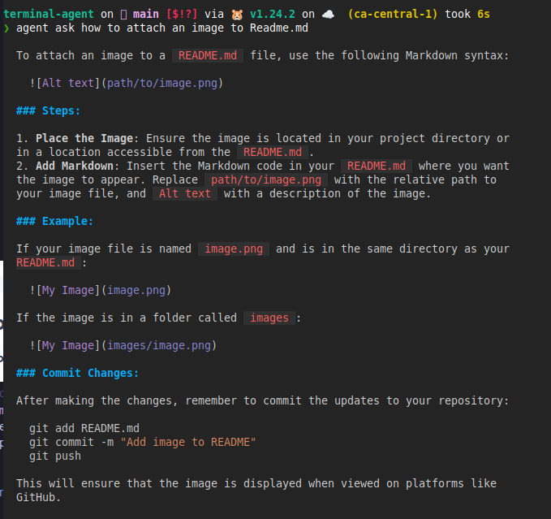
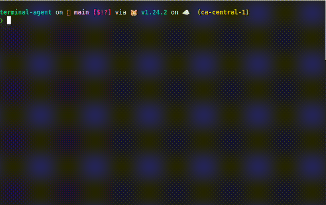

# Terminal Agent Documentation

Welcome to Terminal Agent - an LLM-powered assistant for your terminal needs.

## Contents

- [Getting Started](getting-started.md) - Installation and basic setup
- [Commands](commands.md) - Detailed usage of all commands
  - [Ask Command](commands/ask.md) - Ask questions directly from terminal
  - [Task Command](commands/task.md) - Execute tasks with AI assistance
  - [Tool Command](commands/tool.md) - Use and manage tools
  - [Config Command](commands/config.md) - Configure agent settings
  - [History Command](commands/history.md) - Query interaction history
- [Providers](providers.md) - Supported LLM providers
- [Configuration](configuration.md) - Advanced configuration options
- [Tools](tools.md) - Available tools and extending functionality
- [Examples](examples.md) - Usage examples and patterns
- [Developers](developers.md) - Guide for contributors and developers

### Quick examples

