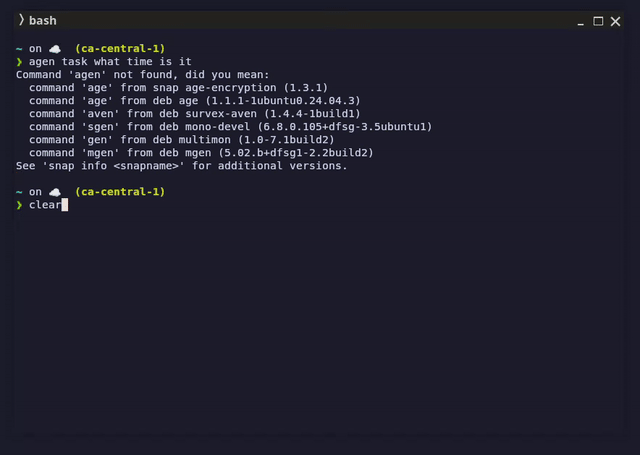
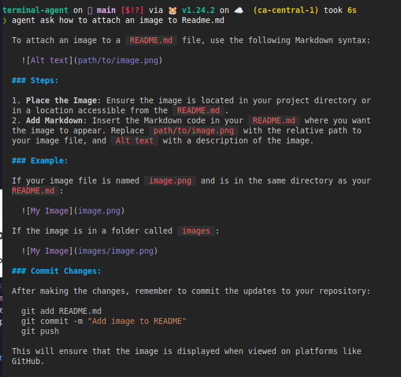
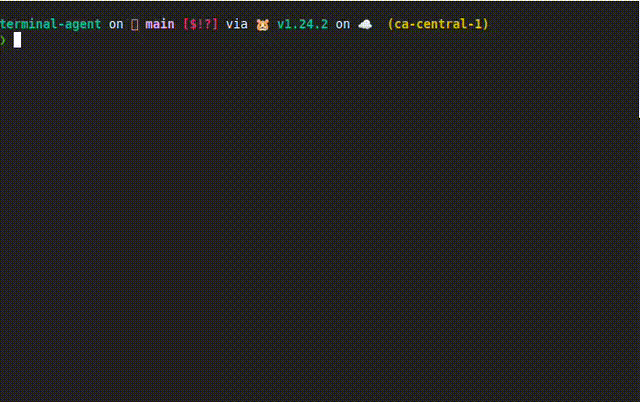

# Terminal Agent Documentation

Welcome to Terminal Agent: an LLM-powered assistant for the terminal, with a desktop popup when you want a faster prompt window. It can answer questions, run supervised workflows, draft scripts, call tools, and switch between hosted model APIs and local runtimes such as Ollama and direct `llama.cpp` GGUF inference.

## See It Work

### Terminal Tasks

Describe what you want in plain language and let Terminal Agent plan the shell steps, ask for approval when needed, and return the result.

The demo includes:

- `agent task what time is it`
- `agent task --auto-approve make a simple curl request to get weather for Vancouver BC`
- `agent task --auto-approve write a script to calculate minutes left until christmas`

### Popup GUI

The popup GUI keeps quick prompts one shortcut away, with the same Ask and Task modes as the CLI plus provider/model switching from the settings screen. See the [Popup GUI guide](gui.md) for the full feature tour.

**Ask mode** streams a markdown answer back into the response panel:

**Task mode** plans steps, runs tools, and shows the transcript and final answer:

## Contents

- [Getting Started](getting-started.md) - Installation and basic setup
- [Commands](commands.md) - Detailed usage of all commands
  - [Ask Command](commands/ask.md) - Ask questions directly from terminal
  - [Task Command](commands/task.md) - Execute tasks with AI assistance
  - [Tool Command](commands/tool.md) - Use and manage tools
  - [Config Command](commands/config.md) - Configure agent settings
  - [History Command](commands/history.md) - Query interaction history
- [Popup GUI](gui.md) - Desktop popup: Ask/Task modes, voice, settings, history
- [Providers](providers.md) - Supported LLM providers
- [Configuration](configuration.md) - Advanced configuration options
- [Approval Logic](approval-logic.md) - How task tool calls are approved, prompted, or denied
- [Integration](integration/fedora.md) - Desktop integration guides
- [Tools](tools.md) - Available tools and extending functionality
- [Examples](examples.md) - Usage examples and patterns
- [Developers](developers.md) - Guide for contributors and developers

## More Examples

